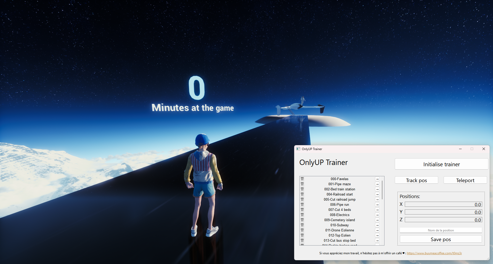

# OnlyUP Trainer

 

This project is for speedrunners. The principle is simple. You can create checkpoints and teleport there to train on particular passages of your run.

## Demo

## Features

- Create custom checkpoints
- Create a key for quick saving position
- Teleport to checkpoints
- Create a key for fast teleportation
- Reset dragon position
- Changing the speed of the dragon

## How to use

- You must launch the program as an administrator
- Once in the game, when you can move not the main menu press "Initialise trainer"

## Author

- [@us3rT0m](https://www.github.com/us3rT0m)

## Contribution

Contributions are always welcome!

## License

[MIT](./LICENSE.md)

## Support

If you have issues, please contact us on [discord](https://discord.gg/hzJu8VmFnN) !
